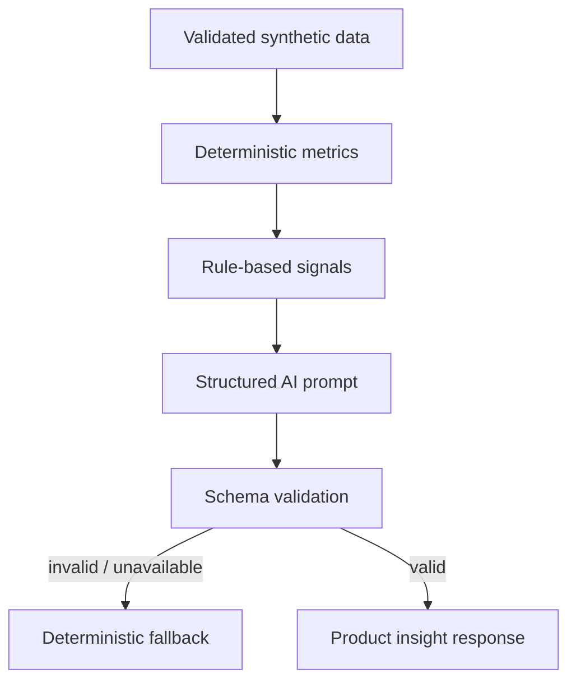

# AI Product Insights

A FastAPI product feature that computes reliable SaaS metrics in deterministic code, then uses a structured AI boundary to explain the results and suggest next questions.

The repository works immediately in `mock` mode. No recruiter or reviewer needs a paid API key.

## What it is

Send synthetic daily product analytics to `POST /v1/insights`. The service validates the input, calculates conversion, activation and retention metrics, detects threshold-based changes, and returns a typed narrative response.

## Why I built it

The useful question is not “Can an LLM calculate a percentage?” It is “Where can probabilistic language improve a product without weakening the correctness of its core?” This project makes that boundary visible in code.

## Architecture



## Where AI Helps — And Where It Should Not Be Used

AI is useful here for:

- summarizing already-computed metrics;
- explaining patterns in approachable language;
- suggesting investigation questions;
- adapting narrative detail to an audience.

AI is deliberately **not** used for:

- counting events or calculating rates;
- defining permissions or data access;
- deciding whether input is valid;
- applying business thresholds;
- fabricating missing data;
- silently changing a metric definition.

Those behaviors stay deterministic, reviewable and testable.

## Structured response

```json
{
  "headline": "Activation improved while retention stayed stable",
  "summary": "Activation increased by 8.2% compared with the previous period.",
  "observations": ["Trial-to-activation improved", "No retention alert was triggered"],
  "suggested_actions": ["Review the onboarding steps changed during this period"],
  "confidence": "medium",
  "mode": "mock"
}
```

The provider result is validated against a Pydantic schema. Invalid or unavailable output is retried once, then replaced with a deterministic fallback that is explicitly labelled.

## Running locally

```bash
cp .env.example .env
docker compose up --build
```

Open `http://localhost:8000/docs`. Mock mode is the default.

```bash
python -m venv .venv && source .venv/bin/activate
pip install -r requirements.txt
uvicorn app.main:app --reload
pytest -q
```

## Prompt organization

Prompts are versioned in `app/prompts.py`, kept separate from calculations, and receive only the minimum structured context needed for the explanation.

## AI usage in development

AI can accelerate exploration, tests and documentation, but all generated code and claims still require review. The tests in this repository focus on deterministic metrics, provider schema enforcement and fallback behavior.

## Future improvements

- Add tenant-aware data access before connecting real analytics.
- Add evaluation fixtures for tone, faithfulness and actionability.
- Track prompt and schema versions with each generated insight.
- Add a human feedback loop without treating feedback as ground truth automatically.

All example data is synthetic.

## License

[MIT](LICENSE)
